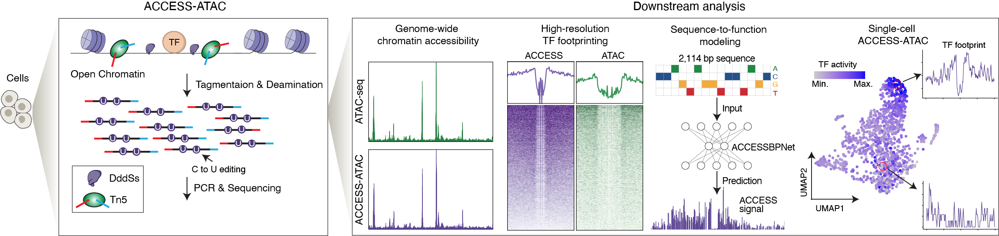

# ACCESS-ATAC

Analysis code for **ACCESS-ATAC**, an assay that measures chromatin accessibility two ways
from a single library:

- **ATAC signal** — Tn5 insertion (cut) sites, derived from fragment ends with a +4 / −5
  offset.
- **ACCESS signal** — per-base **DddSs cytosine deaminase edits**, read off alignments
  as `C→T` (forward strand) and `G→A` (reverse strand) mismatches against the reference.

Because both signals come from the same molecules they can be compared directly, and that
comparison is what most of this repository does.

<p align="center">
  
</p>

The left panel is the assay: Tn5 and the DddSs deaminase act on open chromatin in the same
reaction, Tn5 fragmenting the DNA and the deaminase converting exposed cytosines, so one
library carries both readouts. The right panel is the downstream analysis, covered here by
`01_process_access/` (genome-wide accessibility and TF footprinting),
`03_accessbpnet/` (sequence-to-function modelling, the ACCESSBPNet panel) and
`04_single_cell_access_atac/` (the single-cell panel). `02_tfbs_prediction/` is not
depicted.

## Contents

Four analysis pipelines, each self-contained and each with its own README documenting how
to run it and which paths need adapting.

| Pipeline | What it does |
|---|---|
| [`01_process_access/`](01_process_access/README.md) | Concurrent ACCESS-ATAC in HepG2 and K562: QC, filtering, depth matching, signal tracks, peak calling and TF footprint quantification, compared against ENCODE ATAC-seq. **Start here.** |
| [`02_tfbs_prediction/`](02_tfbs_prediction/README.md) | Benchmark of TF binding site prediction from ACCESS-ATAC signal versus sequence alone. Builds the training data, trains a CNN classifier and evaluates it. |
| [`03_accessbpnet/`](03_accessbpnet/README.md) | ChromBPNet applied to ACCESS-ATAC: bias model, ChromBPNet model, contribution scores, TF-MoDISco, marginal footprints and variant effect prediction. |
| [`04_single_cell_access_atac/`](04_single_cell_access_atac/README.md) | Single-cell ACCESS-ATAC in mouse airway cells: barcode correction, fragment generation, clustering and annotation (ArchR / Seurat), trajectory analysis and TF footprinting. |

## Reproducing the analysis

Within each pipeline, scripts run in the numeric order of their filenames; notebooks are
run interactively at the point where their number falls. The shell scripts are SLURM job
scripts, submitted with `sbatch`.

Each pipeline bundles the Python it needs — under `scripts/`, `model/` or `plotting/` —
so no pipeline reaches into another's code. Those bundled scripts are `argparse`
command-line tools that **import their siblings by bare module name**
(`from utils import ...`). That resolves against the directory the script itself lives in,
so they are invoked by path from the pipeline directory:

```bash
cd 04_single_cell_access_atac
python scripts/fragment_to_bw_atac.py \
    --input_fragments fragments.tsv.gz \
    --chrom_size_file genome.chrom.sizes \
    --out_dir out --out_name sample_atac
```

Shared conventions: paired `--out_dir` / `--out_name` arguments produce
`{out_dir}/{out_name}.{ext}`; coordinates are 0-based half-open (BED convention); output
directories are **not** created automatically.

The pipelines are chained — `02` and `03` consume signal tracks produced by `01` — and all
of them read reference data and raw input from paths that are hard-coded for the cluster
they were run on. Each pipeline's README lists those paths in a "paths that must be
adapted" table.

### Dependencies

Python: `numpy`, `scipy`, `pandas`, `polars`, `pyranges`, `pysam`, `pyBigWig`, `pyfaidx`,
`pybedtools`, `numba`, `torch`, `scikit-learn`, `matplotlib`, `seaborn`, `biopython`,
`tqdm`, plus `h5py`, `hdf5plugin` and `logomaker` for the ChromBPNet evaluation notebooks.

R (single-cell analysis in `04_single_cell_access_atac/`, 13 of its notebooks use an R
kernel): `ArchR`, `Seurat`, `Signac`, `rtracklayer`, `BSgenome.Mmusculus.UCSC.mm39`,
`ggplot2`, `dplyr`, `tidyr`, `tibble`, `cowplot`, `pheatmap`, `ComplexUpset`, `openxlsx`,
`future`.

External tools: `samtools`, `bedtools`, `deeptools`, `MACS2`, UCSC `wigToBigWig` and
`bedGraphToBigWig`, [RGT](https://reg-gen.readthedocs.io/) for motif matching, and
[Nextflow](https://www.nextflow.io/) for the alignment step of pipeline 04. The scripts
also invoke `deamtools`, a separate command-line tool that is not part of this repository.

Training the TFBS classifier (`02_tfbs_prediction/04_train.sh`) and the ChromBPNet models
in `03_accessbpnet/` require a CUDA device.

### Third-party code

`03_accessbpnet/chrombpnet/` is a copy of
[ChromBPNet](https://github.com/kundajelab/chrombpnet) (MIT, Copyright 2019 Kundaje Lab)
with local modifications, taken from the `access` branch of
[lzj1769/chrombpnet](https://github.com/lzj1769/chrombpnet). Its `LICENSE` is included
unchanged, and the modifications are described in
[`03_accessbpnet/chrombpnet/README.md`](03_accessbpnet/chrombpnet/README.md).
